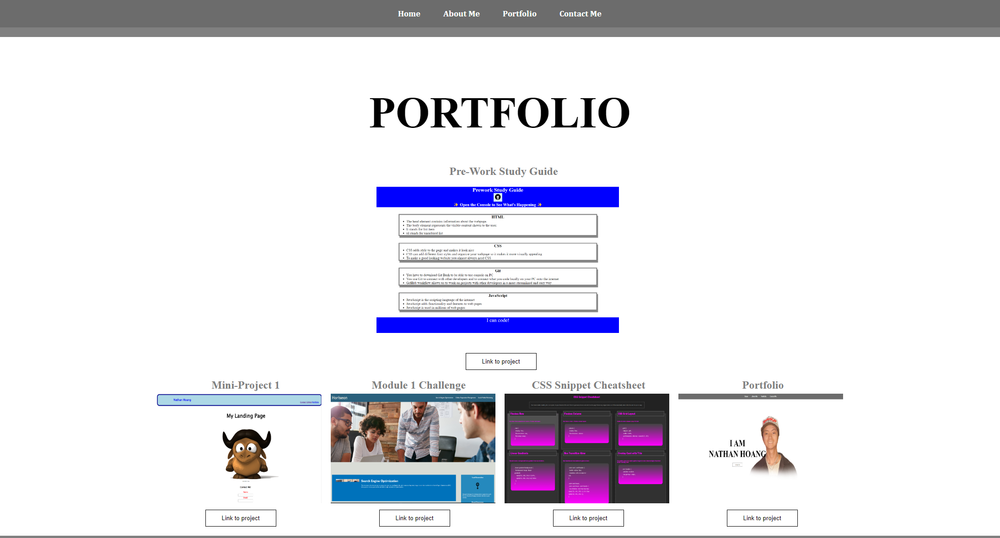

# Nathan Hoang's Portfolio

## Description

I built this website for module 2's challenge for the UCLA bootcamp. This website is a portfolio for me (Nathan Hoang). It includes a home, about me, portfolio, and contact me section. Clicking on any of the portfolio images will take you to the deployed application. This website will help employers learn more about me and allow them to see previous applications or website I have built. Building this website really helped me learn how to put together a full html website with CSS styling. This was my first real website I coded from scratch so writing this website helped me practice where to place elements in the HTML file and how to get everything to look how I want with CSS.

## Usage

This website is fairly simple to use. Click on any of the items in the navbar to take you to that particular section of the page. Click on the image or the button below in the portfolio section to go to the deployed application. Fill out the form at the bottom to contact me.
    

